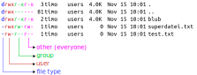

# Berechtigungsstruktur

## Admin-User: root

Der Admin-User unter Linux ist root.
Dieser Benutzer darf absolut alles! Daher sehr mit Vorsicht zu genießen.

## Standardbenutzer: sudo

Unter Linux üblich: sudo für Standardbenutzer um temporär Admin-Rechte zu bekommen. Dazu muss der User in der sudoers-Liste stehen.

> sudo [BEFEHL]

Durch das vorangestellte sudo bei einem Befehl, läuft dieser unter Admin-Rechten. Es wird eine Passwortabfrage verlangt.

> sudo su

Durch "sudo su" kann man eine Admin-Konsole aufmachen, wenn mehrere Arbeiten unter Sudo nötig sind. Schließen mit "exit".

## Datei- und Ordner-Berechtigungen

> ls -lah 

Zeigt auch die Benutzerrechte 

Die Berechtigungen in Linux in HEX-Darstellung

| Wert                |    Recht    |
|---------------------|-------------|
|  0                  |  Keine      |
|  1                  |  x          |
|  2                  |  w          |
|  3                  |  w+x        |
|  4                  |  r          |
|  5                  |  r+x        |
|  6                  |  r+w        |
|  7                  |  r+w+x      |

- x: execute (Ausführungsrechte)
- w: write (Schreibrechte)
- r: read (Leserechte)

### Beispiele

| Zahl   |  Bedeutung                                                                   |
|--------|------------------------------------------------------------------------------|
|   644  |  Der Eigentümer darf lesen und schreiben, alle anderen nur lesen.            |
|   744  |  Der Eigentümer darf lesen, schreiben und ausführen, alle anderen nur lesen. |
|   660  |  Eigentümer und Gruppe dürfen lesen und schreiben, der Rest nichts.          |

## Benutzer und Gruppen

> ls -lah

Zeigt auch die Benutzer und Gruppen an. Im Bild:
- Benutzer: timo
- Gruppe: users

Später mehr zu Benutzer und Gruppen.

## Datei- und Ordnerberechtigung anpassen

> chmod 754 superdatei.txt

Ändert die Rechte der Datei "superdatei.txt" auf:
- **Eigentümer** darf lesen, schreiben und ausführen
- **Die Gruppe** darf lesen und ausführen
- **Alle anderen** dürfen nur lesen

> chown [BENUTZER]:[GRUPPE] superdatei.txt

Ändert den Benutzer und die Gruppe der Datei superdatei.txt