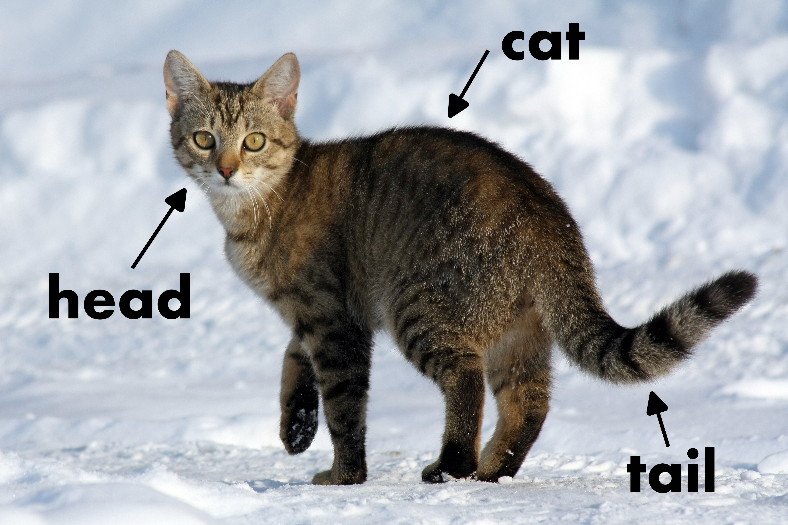
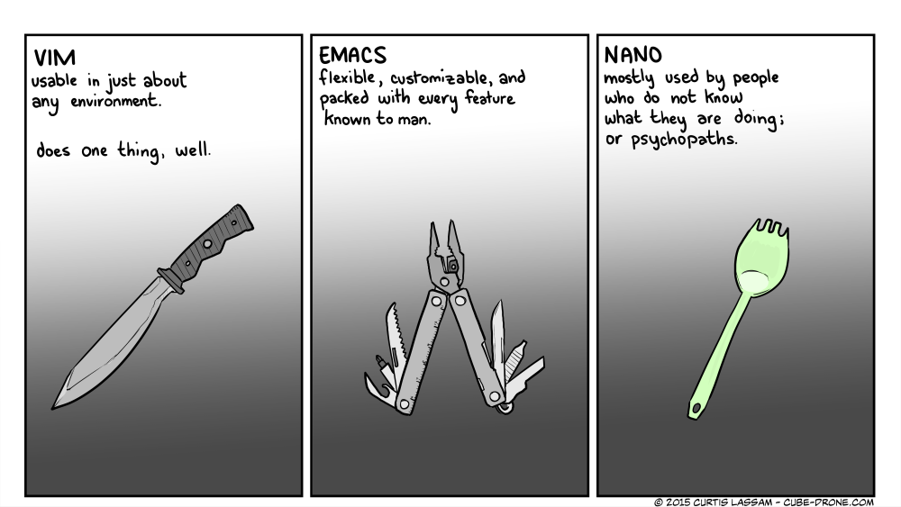

# Dateien und Ordner

## mkdir - Erstellen von Ordnern

> mkdir Testordner

Erstellt den Ordner "Testordner" im aktuellen Verzeichnis.

> mkdir -p Testordner/test/test2

Erstellt "test2" im Ordner "test". Wenn "test" nicht existiert, wird dieser auch erstellt. Wenn "Testordner" nicht existiert wird dieser auch erstellt.

## touch - Erstellen von Dateien

> touch test.txt

Erstellt die Datei test.txt im aktuellen Verzeichnis. Touch wird eher selten verwendet, denn jeder Editor erstellt beim Speichern die Datei automatisch.

## head, cat, tail

head cat und tail am Beispiel einer Katze¹

> cat /var/log/syslog

Zeigt die gesamte Datei "syslog" im Verzeichnis /var/log/

> head /var/log/syslog

Zeigt die obersten 10 Zeilen der Datei "syslog"

> tail /var/log/syslog

Zeigt die letzten 10 Zeilen der Datei "syslog"

tail ist überaus praktisch für debugging und das lesen von logs:

> tail -n1000 /var/log/syslog

Zeigt die letzten 1000 Zeilen der Datei "syslog"

> tail -f

Zeigt die letzten 10 Zeilen und aktualisiert automatisch wenn neue Zeilen hinzu kommen.

## Dateien editieren - Der Editor Kampf

Es gibt verschiedene Standard-Tools:

- Emacs - Kann alles, relativ komplex
- vim - Kann Textdateien bearbeiten und das sehr gut, ist fast überall installiert, relativ komplex im Umgang
- nano - Sehr einfach, ist überall installiert

-> Wir nehmen **Nano**

Vergleich von vim, emacs und nano²

## Dateien verschieben, kopieren und Verknüpfungen erstellen

### mv - Move (and rename) files

mv wird zum verschieben von Dateien verwenden. Man kann eine Datei auch auf einen anderen Dateinamen verschieben (also umbenennen).

> mv QUELLE ZIEL

Zuerst die Quelle, dann das Ziel

> mv /home/ansible/test.txt /home/ansible/Testordner/

Die Dateie test.txt wird in den Unterordner Testordner verschoben.

> mv /home/ansible/test.txt /home/ansilbe/neuertest.txt

Die Datei test.txt wird in neuertest.txt umbenannt.

### cp - copy files and directories

> cp QUELLE ZIEL

Wieder zuerst die Quelle, dann das Ziel

> cp test.txt test2.txt

Kopiert die Datei test.txt zu test2.txt

> cp -r Testordner Testordner2

Achtung: Bei Ordnern muss "-r" für recursively dabei sein.

### ln - make links between files

Bei "ln" gibt es zwei arten von Links:

- Softlink (Symlink): Ein Softlink ist nur ein praktischer Zeiger auf ein anderes Dateiobjekt. Typischerweise dient er auf der grafischen Oberfläche als Abkürzung an zentraler Stelle – etwa am Desktop – zu einem abgelegen Ort.
    - Wird relativ häufig verwendet. Auch bei uns später. 
- Hardlink: Repräsentieren eine identische Datei an zweiter oder mehrfacher Stelle im Dateisystem. Eher selten in Verwendung.
    - Wird oft bei Backups verwendet, sonst nur Spezialanforderungen. Wir beschränken uns im Beispiel auf Symlinks.

> ln -s QUELLE ZIEL

Das "-s" steht für symbolisch bzw. symlink.

### rm - remove files or directories

> rm [ORDNER/DATEINAME]

Löscht Dateien. Achtung: Bei Ordnern muss ein -r mit angegeben werden. Absolute Vorsicht bei den Optionen -f und "rm -r /"

-----
¹Quelle (CC-BY-SA 3.0): https://commons.wikimedia.org/wiki/File:Felis_catus-cat_on_snow.jpg
²Quelle: https://twitter.com/SchindlerTimo/status/1592158402373091328
