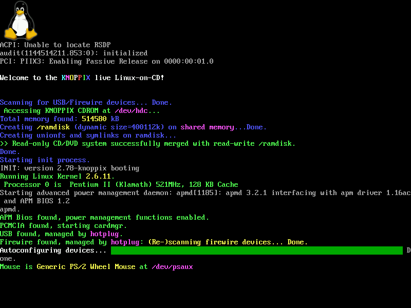

# Was ist Linux?

- Betriebssystem ähnlich wie Windows
- Kostenlos und Opensource
- Basiert auf Unix (oft auch Linux/Unix oder GNU/Linux)
- Viele verschiedene Varianten, sog. Distributionen
- Marktanteile:
    - Desktopsystem: **2,8**%¹
    - Webserver: **96,3**%²
    - Cloudserver: **90**%³
    - Supercomputer: **100**%⁴
- MacOS nutzt z.B. auch UNIX

Screenshot des Desktopsystems KDE Plasma 5.25⁵

Screenshot der Konsolenausgabe bei Knoppix 3.8⁶

# Was ist der Unterschied zu Windows?

- Opensource (bei Linux zum großen Teil auch für die installierten Programme)
- Die Art Programme zu installieren -> Direkter Download bei Windows vs. Pakete bei Linux
- Microsoft Office
- Arbeitswelt hat sich auf Windows verständigt
- Bei Linux nach wie vor relativ häufig die Konsole nötig/sinnvoll
- Linux: Die meisten Updates benötigen keinen Neustart
- Linux: Updates zentral für Betriebssystem + installierte Programme
- Linux: Stabilität in der Regel höher
- Linux: IT-Sicherheit oft sehr hoch, Windows oft Ziel von Malwareangriffen (auch bei Linux möglich!)
- Im Kern: Linux-Kernel
- Linux in der Regel sehr schlank und wenig Ressourcen-Verbrauch -> gut geeignet für ältere und schwächere Hardware

# Distributionen

## Was ist eine Distribution?
- Auswahl an abgestimmten Programmen zum jeweiligen Kernel
- Meist für einen bestimmten Zweck
- Leicht unterschiedliche Paketverwaltung

## Die großen Distributionen
- **Debian**
  - Große Communty, auch in Deutschland
  - Basis der meisten Distributionen
  - Sehr stabiles System
  - Oft abgehangene Software
- **Ubuntu**
  - Basiert auf Debian
  - Sehr große Community
  - Als Firma steht Canonical dahinter
  - Die meiste Hilfe für Debian trifft auch auf Ubuntu zu
  - Häufigstes Desktopsystem
  - Stabiles System
  - Eher neuere Softwarekomponenten
  - LTS-Support
- **Arch**
  - Sehr große Community
  - Bleeding Edge
  - Immer die neusten Softwarekomponenten
  - Eher instabil
- **SUSE**
  - Hauptsächlich in Deutschland verbreitet
  - Premiumsupport
- **Red-Hat**
  - Hauptsächlich in USA verbreitet
  - Premiumsupport

Debian-Derivate⁷

## Empfehlung für Anfänger

Einsteigerfreundlich: **Ubuntu** (viele HowTos, Community, Umstiegshilfen, etc.)

------
¹ Quelle: https://de.statista.com/statistik/daten/studie/157902/umfrage/marktanteil-der-genutzten-betriebssysteme-weltweit-seit-2009/

² Quelle: https://www.zdnet.com/home-and-office/networking/can-the-internet-exist-without-linux/

³ Quelle: https://www.basicthinking.de/blog/2022/01/13/warum-nutzen-so-wenige-menschen-linux/

⁴ Quelle: https://itsfoss.com/linux-runs-top-supercomputers/

⁵ Quelle: https://de.wikipedia.org/wiki/Linux#/media/Datei:KDE_Plasma_5.25_screenshot.png

⁶ Quelle: https://en.wikipedia.org/wiki/Linux_console#/media/File:Knoppix-3.8-boot.png

⁷ Quelle: https://de.wikipedia.org/wiki/Liste_von_Linux-Distributionen#/media/Datei:DebianFamilyTree1210.svg