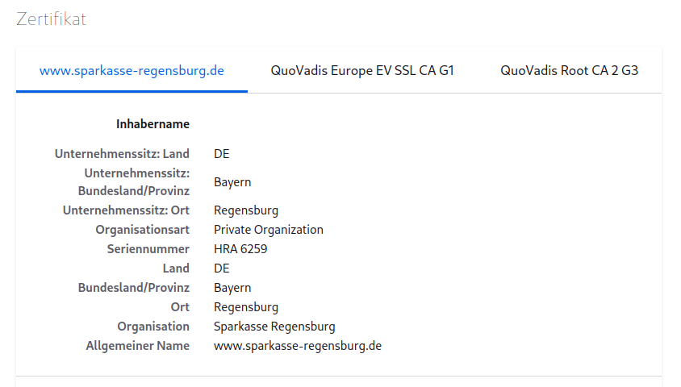
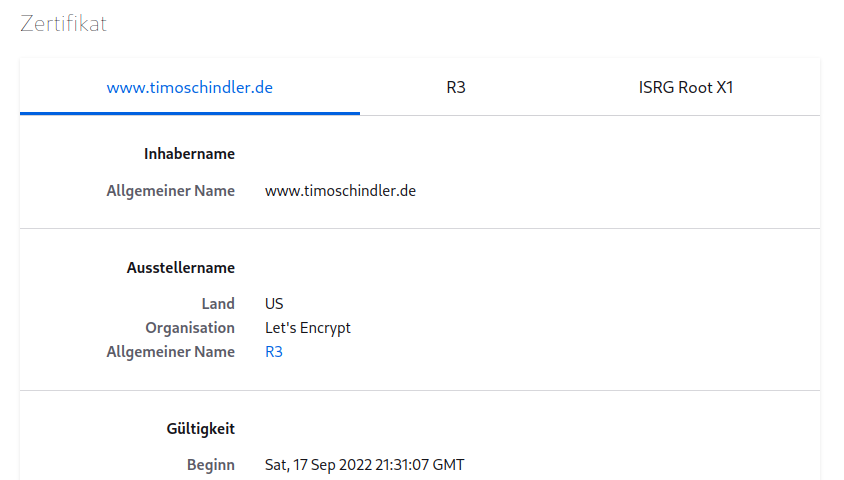
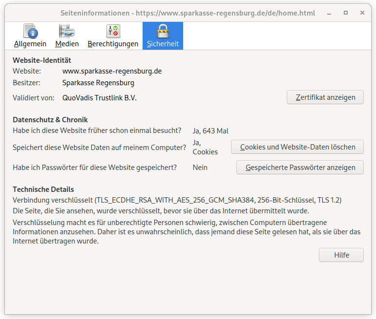
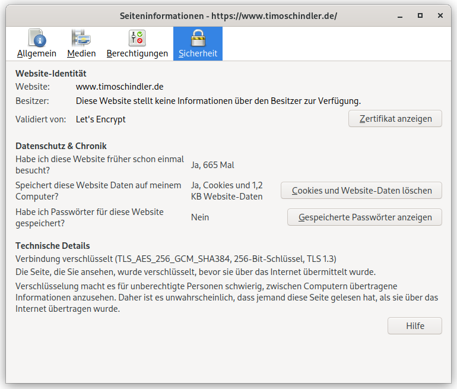

# Transportverschlüsseung und Sicherheit

- Die Standard Konfiguration ist bereist OK, aber nicht bereit für echte Websites
- Transportverschlüsselung ist unbedingte Voraussetzung
- Websites können sonst nicht dargestellt werden
- In unserem Fall: Selbst signierte Zertifikate

## TLS und Zertifikate

- Im Allgemeinen Sprachgebrauch: TLS = SSL = https = Verschlüsselte Verbindung
- Alles zusammen: Protokolle zur Transport-Verschlüsselung
- SSL ein sehr altes Protokoll
- Aktuell: TLS 1.2 und 1.3 die einzigen noch sicheren Protokolle

## Zertifikate
- Zertifikate erfüllen zwei Zwecke: **Transportverschlüsselung** und **Authentizität**

### Authentizität



Zertifikat von www.sparkasse-regensburg.de

<br>



Zertifikat von www.timoschindler.de

### Transportverschlüsselung


Zertifikat von www.sparkasse-regensburg.de



Zertifikat von www.timoschindler.de

## TLS bei nginx einrichten

## Zertifikat (selbst signiert) erstellen

> sudo openssl req -x509 -nodes -days 365 -newkey rsa:2048 -keyout /etc/ssl/private/nginx-selfsigned.key -out /etc/ssl/certs/nginx-selfsigned.crt

Erklärung:
- **openssl**: Kommandozeilenwerkzeug zum Erstellen und Verwalten von OpenSSL-Zertifikaten, Schlüsseln und anderen Dateien.
- **req**: X.509-Zertifikatssignierungsanforderungen (CSR) soll verwendet werden (X.509 ist ein Infrastrukturstandard für öffentliche Schlüssel)
- **-x509**: Ändert den vorherigen Befehl weiter ab: Es soll selbstsigniertes Zertifikat erstellen werden, statt Zertifikatsignierungsanforderung
- **-nodes**: Zertifikat nicht mit Passwort sichern. Nötig für nginx!
- **-days 365**: Gültigkeitszeitraum
- **-newkey rsa:4096**: Zertifikat und gleichzeitig Schlüssel. Außerdem RSA mit 4096 bit Schlüssellänge
- **-keyout**: Wo soll private Schlüsseldatei gespeichert werden
- **-out**: Wo soll Zertifikat abgelegt werden

```
.+...+...........+.+...+..+++++++++++++++++++++++++++++++++++++++++++++++++++++++++++++++++*..+.+..+...+.+.....+.........+......+....+.........+++++++++++++++++++++++++++++++++++++++++++++++++++++++++++++++++*............+...+...........+............+.............+......+........+......+......+..................+.............+..+...+....+.....+.+...+.....+......+...+...............+.+..+....+........+......+.+.........+.....+......+......+.......+..+.+.....+....+....................+.+..+.......+...+..+...+.+.....+.+......+..+...+++++++++++++++++++++++++++++++++++++++++++++++++++++++++++++++++
..+..+++++++++++++++++++++++++++++++++++++++++++++++++++++++++++++++++*.....+.........+++++++++++++++++++++++++++++++++++++++++++++++++++++++++++++++++*...+.....+............+..........+......+..+.+..+...+.......+..+............+.........+....+..+...+...+.............+.....+.......+.........+..............+....+...+..+.............+...+...........+...+..........+...........+......+......+...+.......+..+.+......+..................+...........+++++++++++++++++++++++++++++++++++++++++++++++++++++++++++++++++
-----
You are about to be asked to enter information that will be incorporated
into your certificate request.
What you are about to enter is what is called a Distinguished Name or a DN.
There are quite a few fields but you can leave some blank
For some fields there will be a default value,
If you enter '.', the field will be left blank.
-----
Country Name (2 letter code) [AU]:DE
State or Province Name (full name) [Some-State]:Bayern
Locality Name (eg, city) []:Regensburg
Organization Name (eg, company) [Internet Widgits Pty Ltd]:Landesamt für Finanzen
Organizational Unit Name (eg, section) []:
Common Name (e.g. server FQDN or YOUR name) []:
Email Address []:
```

## TLS-Konfiguration bei nginx erstellen:

        # SSL configuration
        #
        listen 443 ssl default_server;
        listen [::]:443 ssl default_server;
        ssl_certificate /etc/ssl/certs/nginx-selfsigned.crt;
        ssl_certificate_key /etc/ssl/private/nginx-selfsigned.key;


> systemctl restart nginx.service

Die Website ist jetzt per https:// erreichbar!