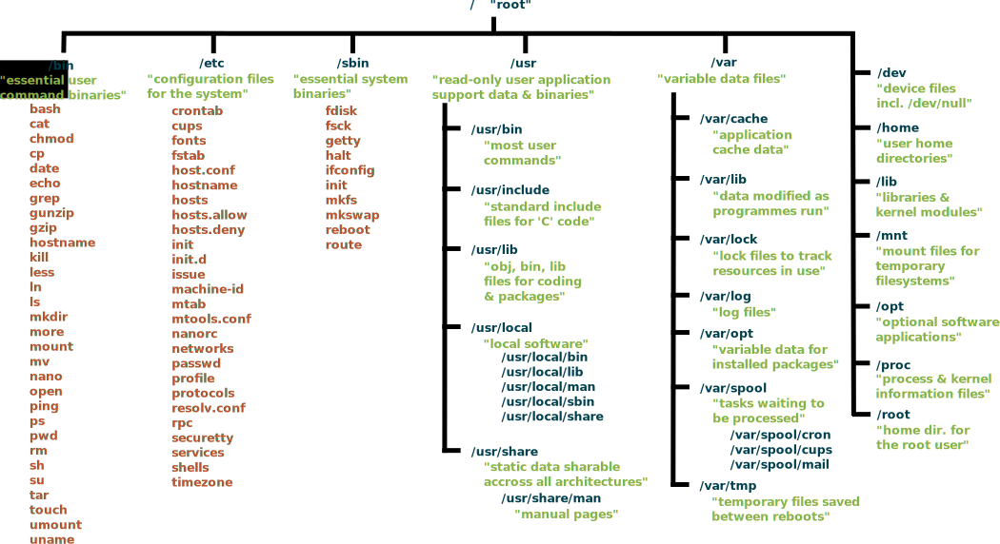

# Die Wichtigsten Befehle

## ls - list directory contents

> ls

Eine Liste des Aktuellen Verzeichnisses

> ls /root/

Eine Liste von /root/

> ls -l

Die Liste als übersichtliche Liste

> ls -la

Liste als Liste und versteckte Dateien

> ls -lah

Liste als Liste und versteckte Dateien. Human Readable

## cd - change the working directory

> cd

Der reine Befehle

> cd ..

Einen ordner zurück

> cd /home/ansible

Springe in Ordner /home/ansible

> cd /

Ins Absolute Wurzelverzeichnis springen.

# Einschub: Ordner-Struktur in Linux - Filesystem Hierarchy Standard (FHS)

Der Filesystem Hierarchy Standard (FHS) ist eine Richtlinie für die Verzeichnisstruktur unter Unix-ähnlichen Betriebssystemen.

ilesystem Hierarchy Standard in Linux¹

Die wichtigsten Ordner im täglichen Admin-Leben (alphabetisch sortiert):

- **/etc**
	- Host-spezifische Systemkonfiguration (fast alle Config-Dateien)
- **/home**
	- Verzeichnisse der Benutzer
- **/media**
	- Einhängepunkt für Wechseldatenträger
- **/mnt**
	- Einhängepunkt für temporär eingehängtes Dateisystem
- **/opt**
	- Zusätzliche Anwendungsprogramme (alles was nicht aus den Paketquellen kommt)
- **/srv**
	- Daten für Dienste, auch Webserverdaten
- **/var**
	- variable Daten, Logdaten, etc.

## Auf dem Dateisystem und Server orientieren

### df - report file system disk space usage

> df -h

Zeigt die aktuellen Filesysteme und wie viel noch frei ist (human readable)

### lsblk - list block devices

> lsblk

Übersicht aller eingehängten Block Devices

> lsblk -O

Liefert alle Informationen

> lsblk -oName,SIZE,TYPE,MOUNTPOINT,FSTYPE,UUID

Liefert außerdem noch Mountpunkt, Filesystemtyp und UUID

### top - display Linux processes

Zeigt aktuellen RAM-Verbrauch, CPU-Leistung und eine Liste der laufenden Programme

> top

Beenden mit [q]

Etwas schöner ist "htop", das muss aber erst auf den meisten Systemen installiert werden. Dazu später mehr.

### ps - report a snapshot of the current processes

> ps -eF

Zeigt alle Informationen. Sehr praktisch zusammen mit grep:

> ps -eF | grep bash

-----
¹ Quelle: https://commons.wikimedia.org/wiki/File:Standard-unix-filesystem-hierarchy.svg